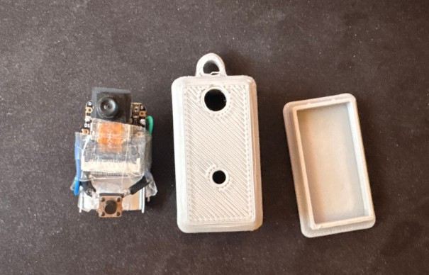
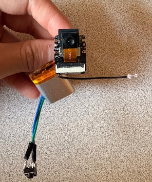
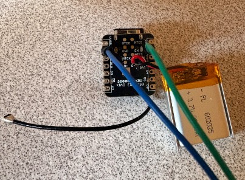
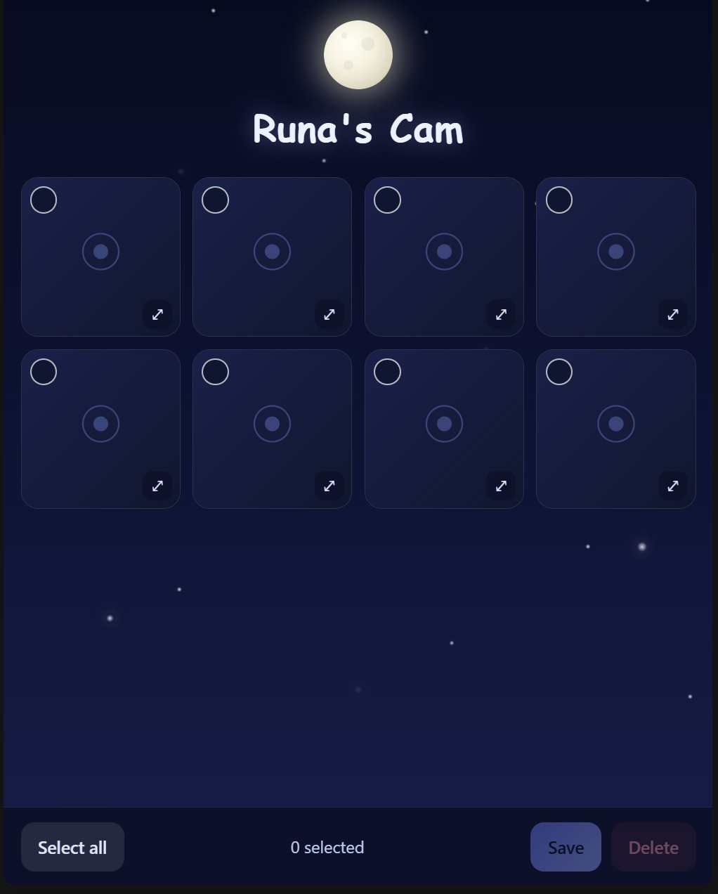

# ESP32-S3 Keychain Camera

A pocket-sized WiFi-transfer keychain camera built on a **Seeed XIAO ESP32-S3 Sense** (OV3660 sensor), 16 GB microSD, and a 200 mAh Li-Po in a custom 3D-printed enclosure. One-button operation: tap to snap, later dump photos to a phone over WiFi — no app, no cable.

---

## Features

- **Single button, three modes** — capture, WiFi transfer, sleep — all driven by press duration
- **Deep sleep between shots** — the ESP32-S3 wakes on the button, captures a timestamped JPEG, and goes back to sleep, so the 200 mAh battery lasts through weeks of casual use
- **Access-point WiFi transfer** — long-press to broadcast a local WiFi network; connect from a phone and pull photos through a browser-based gallery, no app required
- **On-device storage** — photos saved to microSD as `YYYY-MM-DD_HH-MM-SS.jpg`, so filenames sort chronologically

## Button map

| Action | What it does |
|---|---|
| **Single tap** (device asleep or awake) | Wakes the camera, captures a photo, saves as `YYYY-MM-DD_HH-MM-SS.jpg`, returns to deep sleep |
| **Hold 3 seconds** | Enters WiFi transfer mode — broadcasts an AP. Connect from your phone, then open a browser to `192.168.4.1` for the photo gallery |
| **In WiFi mode — tap a photo** | Selects it |
| **In WiFi mode — tap Save** | Opens a lightbox — long-press the image to save to the phone's camera roll |
| **In WiFi mode — single button tap** | Exits WiFi mode, returns to normal sleep/capture |
| **Idle 2 minutes in WiFi mode** | Auto-exits to sleep to save battery |

## Hardware

| Component | Part |
|---|---|
| MCU + camera | Seeed XIAO ESP32-S3 Sense (OV3660) |
| Storage | 16 GB microSD |
| Battery | 200 mAh Li-Po |
| Input | Single momentary tactile switch |
| Enclosure | Custom 3D-printed (SolidWorks) |

## Toolchain

PlatformIO · Arduino-ESP32 core · SolidWorks (enclosure) · standard ESP32 camera + WebServer libraries

## Samples

---

*Ryan Tao · [ryanlintao.com](https://ryanlintao.com)*
